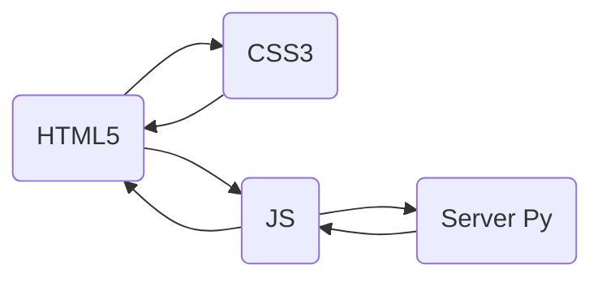

## Mi Servidor🌐
¡Bienvenido a Mi Servidor! Esta aplicación proporciona una interfaz de usuario para explorar y visualizar datos de la API JSONPlaceholder. Aquí también podrás acceder a información detallada sobre posts, comentarios, álbumes, fotos, todos los usuarios, ¡y mucho más!

(Se utiliza el mismo servidor de la appConsola)

### Funcionalidades⚙️
`Consulta de endpoints:` Puedes seleccionar un endpoint de la lista desplegable para obtener información detallada sobre el mismo. Una vez seleccionado el endpoint, se mostrará el total de registros disponibles.
`Obtener Detalle:` Al ingresar un ID en el campo correspondiente y hacer clic en el botón "Obtener Detalle", se mostrará el detalle del registro correspondiente al ID seleccionado.

`Detalle de Usuario:` En el caso de los registros qaue contienen "userId", se mostrará un botón adicional "Detalle del Usuario". Al hacer clic, se abrirá un modal con información detallada sobre el usuario, a su vez, como los datos del usuario son muy extensos, se ocultaron los detalles de Dirección y Compañía, pero al hacer click en Mostrar, aparecen los datos.
 
### Estructura del proyecto📂
`index.html:` La página principal de la aplicación, que incluye la interfaz de usuario y los elementos interactivos.
`script.js:` El archivo JavaScript que contiene la lógica de la aplicación, incluyendo el manejo de eventos y las llamadas a la API.
`servidor.py:` El servidor que recibe las peticiones y devuelve las respuestas en formato JSON.

### Configuración y Uso🛠️
Asegúrate de tener instalado Python en tu máquina.
Descarga los archivos de la aplicación en tu directorio local.
Abre una terminal y navega hasta el directorio donde se encuentran los archivos descargados.
Ejecuta el comando:

    python servidor.py

para iniciar el servidor.

Abre tu navegador web y visita http://localhost:8080 para acceder a la aplicación.

### Tecnologías utilizadas💻

### Recursos externos🔗
`Bootstrap (CDN):` Utilizado para los estilos y componentes de interfaz.
`jQuery (CDN):` Utilizado para facilitar la manipulación del DOM y el manejo de eventos.

### Licencia 📄

Este proyecto se encuentra bajo la licencia MIT.

