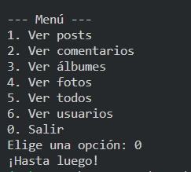

# Aplicación de Consola de Python 🐍

Esta es una aplicación de consola de Python que junto con un servidor, interactúa con una API JSONPlaceholder para mostrar diferentes tipos de registros. Proporciona una interfaz de usuario intuitiva para seleccionar el tipo de registro y visualizar los detalles de cada registro según el ID proporcionado.

## Características ⭐️

- Consulta de diferentes tipos de registros: posts, comentarios, álbumes, fotos, todos y usuarios.
- Traducción automática de los campos de los registros al español. (solo en post, se traduce el titulo y el contenido)
- Interfaz de usuario intuitiva y fácil de usar.
## Diagrama de Endpoints 🗺️

El siguiente diagrama Mermaid muestra la estructura de los endpoints disponibles en la API JSONPlaceholder.

```mermaid
graph RL
 A[Inicio] --> B(post)
 A --> C(comments)
 A --> D(albums)
 A --> E(photos)
 A --> F(todos)
 A --> G(users)
 ```
  
 ```mermaid
graph LR
 B(post)-->userId
 B-->id
 B-->title
 B-->body
 ```
 ```mermaid
graph LR
 C(comments)-->userId
 C-->id
 C-->title
 C-->postId
 C-->name
 C-->email
 C-->body
 ```
 ```mermaid
graph LR
 D(albums)-->userId
 D-->id
 D-->title
 ```
 ```mermaid
graph LR
 E(photos)-->albumId
 E-->id
 E-->title
 E-->url
 E-->thumbnailUrl
 ```
 
 ```mermaid
graph LR
 F(todos)-->userId
 F-->id
 F-->title
 F-->completed
 ```
 ```mermaid
graph LR
 G(users)-->id
 G-->name
 G-->username
 G-->email
 G-->h(address)
 G-->phone
 G-->website
 G-->j(company)
 h-->street
 h-->suite
 h-->city
 h-->zipcode
 h-->i(geo)
 i-->lat
 i-->lng
 j-->k(name)
 j-->catchPhrase
 j-->bs
 ```
 
 
## Instalación 🚀


1. Clona este repositorio en tu máquina local:
git clone https://github.com/tu-usuario/tu-repositorio.git

2. Navega hasta el directorio del proyecto:
cd tu-repositorio
3. Instala las dependencias necesarias:
- pip install -r requirements.txt


## Uso 📖

#### Primero ejecuta el Servidor
La aplicación requiere el uso de un servidor y obtener los datos necesarios. Para ello, se proporciona el archivo servidor.py, el cual actúa como un servidor HTTP que se conecta a diferentes endpoints y devuelve la respuesta en formato JSON, ya tiene definidas las variables hostName y serverPort, siéntete libre de modificarlas.
1. Abre una terminal o línea de comandos.

2. Navega hasta el directorio donde se encuentra el archivo servidor.py.

3. Ejecuta el siguiente comando:

- python servidor.py

  Esto iniciará el servidor en http://localhost:8080 y estará listo para recibir solicitudes.

4. Mantén el servidor en ejecución mientras utilizas la aplicación de consola de Python. El servidor se encargará de realizar las solicitudes a los endpoints correspondientes y devolver los datos solicitados en formato JSON.


#### A continuación
1. Ejecuta el script principal:
python appConsola.py

2. Sigue las instrucciones en la consola para seleccionar el tipo de registro (endpoint) y el ID del registro que deseas visualizar.




<hr>
En el archivo `MiServidor.md` se encuentra la documentación de un proyecto similar, pero en entorno Web.


